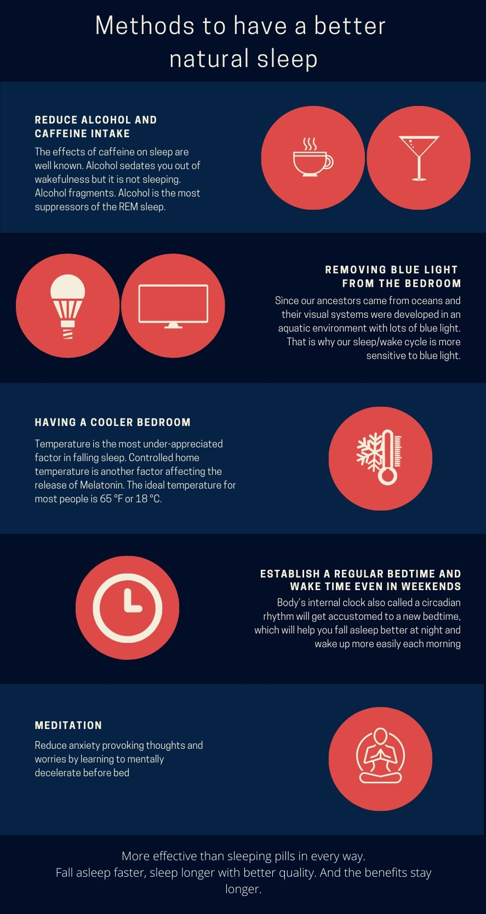
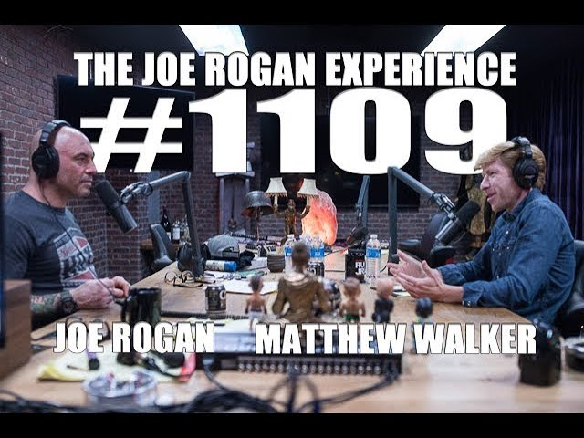
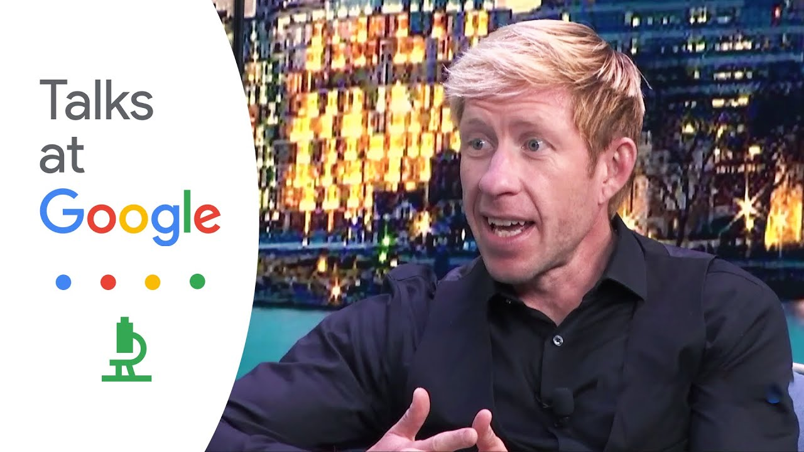

We spend one-third of our life sleeping. We all heard/read this or a similar phrase at some point in our life. Subconsciously, I considered sleeping a waste of time. Don't get me wrong though, I enjoyed sleeping as much as anyone does. However, for me, sleep was the first to sacrifice at the time of need. If I had a deadline for a project/exam/competition, I always pulled an all-nighter or two, and I was proud of it. It got to a level that at some point, I was looking for ways to sleep efficiently and as little as possible. If you search online there are lots of information on different sleep patterns. Patterns like Biphasic, Dymaxion, Uberman, Everyman, and others some of which give you 2 hours of total sleep during the day by dividing it to 20-minute naps during the day. I never dared to push myself to that extreme but I tried having 4 hours of sleep at night with a couple of 20-minute naps during the day and I planned to push it further. Even though it was hard at the beginning, I felt good and thought I can do it. However, it wasn't sustainable. As it is mentioned in the book, even millions of years of evolution couldn't find a way to win the fight against sleep: 

> From an evolutionary perspective, sleep is one of the most puzzling. When you are asleep you are not gathering food or avoiding predators. If sleep is not absolutely necessary then sleep is the biggest mistake that evolution made. 

so I ceased fire and surrendered. Another part of the book which fascinates me is in chapter 4 of the book, where the author attributes our cognitive intelligence and the Degree of social and cultural complexity to REM sleep.

>Rapid Eye Movement or REM sleep and Non-Rapid Eye Movement or NREM sleep are the two completely different sleep stages that we experience but not all animals experience all stages of sleep. Most animals experience NREM sleep. Only birds and mammals experience REM sleep. Since birds(dinosaurs!) and mammals evolved separately, evolution might have invented REM sleep twice under the same evolutionary pressures. This also suggests REM sleep has occurred later in the evolutionary tree and it is not replaceable by NREM sleep. Compared to our closest cousins in the evolutionary tree monkeys, chimpanzees, orangutans, and apes we sleep shorter but we sleep better. We sleep better in the sense that we experience more REM sleep. During REM sleep, our bodies are paralyzed to avoid sending motor commands while we dream. This might be the limiting factor and the reason primates cannot experience more of the intense REM sleep. Homo-Erectus was the first to walk on two legs and sleep on the ground. Sleeping on the trees is a good strategy to avoid predators, however, it was putting a cap on our evolutionary capacity.
 

Reading this book gave me a new perspective and made sleep something I look forward to every night. The book's author is Matthew Paul Walker, a neuroscience and psychology professor at the University of California, Berkeley. The book starts with dire warnings about how sleep deprivation will affect the immune system, causes depression, anxiety, obesity, doubles the risk of cancer, affects blood sugar levels in pre-diabetics, and determines if you get Alzheimer's. And then goes on explaining sleep cycles, how our sleep evolves throughout our lives and how it affects us, sleep mechanisms, and how they work. He also spends some time on how sleep affects our work, education, and social life. In the end, he provides a guideline to change our sleep for the better.

 

  
Not all of the claims in the book might be accurate and scientific-based on what Alexey suggests in this [blog post](https://guzey.com/books/why-we-sleep/). However, I tend to feel that reading(Listening to) it changed my life and how I view sleep for the better and I hope it does the same for you.

If you are interested but do not have time to read the book, checkout the authors interviews with joe rogan and his talk at Google.
   

   

