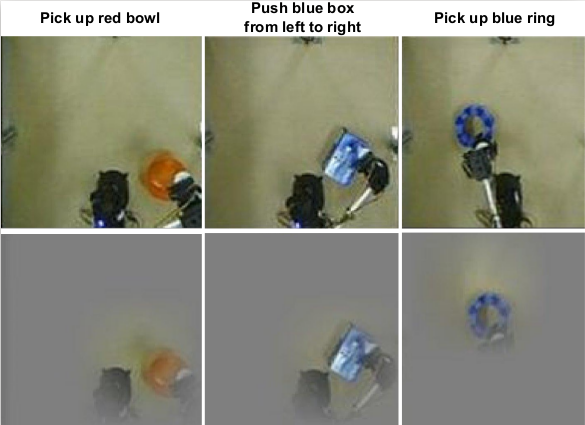

| **Paper:** &nbsp;&nbsp;&nbsp;&nbsp;&nbsp;&nbsp;&nbsp;&nbsp;&nbsp;&nbsp;&nbsp;&nbsp;&nbsp;&nbsp;&nbsp;&nbsp;&nbsp;| [Pay attention! - Robustifying a Deep Visuomotor Policy through Task-Focused Visual Attention](https://www.crcv.ucf.edu/wp-content/uploads/2019/05/Publications_Pay_attention.pdf)|

| **Dataset:**|[AnnotationTask1](https://www.crcv.ucf.edu/wp-content/uploads/2019/05/Projects_PayAttention_5001_task_annotation.csv)&nbsp;&nbsp;&nbsp;&nbsp;&nbsp;&nbsp;&nbsp;&nbsp;&nbsp;[AnnotationTask2](https://www.crcv.ucf.edu/wp-content/uploads/2019/05/Projects_PayAttention_5002_task_annotation.csv)&nbsp;&nbsp;&nbsp;&nbsp;&nbsp;&nbsp;&nbsp;&nbsp;&nbsp;[Videos](https://www.crcv.ucf.edu/datasets/files/camera-1.zip)|
|**Slides**|[Click Here](https://www.crcv.ucf.edu/wp-content/uploads/2019/06/Projects_PayAttention_Slides.pptx)|
|**Video**|[Click Here](https://youtu.be/eh43sI4v9ag)|
|**Concats**|[Pooya Abolghasemi](mailto:pooya.abolghasemi@knights.ucf.edu), [Amir Mazaheri](mailto:amirmazaheri@knights.ucf.edu)|

 
**Publication:**
 
Abolghasemi, Pooya, et al. [“Pay attention! – Robustifying a Deep Visuomotor Policy through Task-Focused Attention.”](https://www.crcv.ucf.edu/wp-content/uploads/2019/05/Publications_Pay_attention.pdf) Proceedings of the IEEE conference on computer vision and pattern recognition. 2019
 
 
**Overview:**
 

Several recent studies have demonstrated the promise of deep visuomotor policies for robot manipulator control. Despite impressive progress, these systems are known to be vulnerable to physical disturbances, such as accidental or adversarial bumps that make them drop the manipulated object. They also tend to be distracted by visual disturbances such as objects moving in the robot’s field of view, even if the disturbance does not physically prevent the execution of the task. In this paper, we propose an approach for augmenting a deep visuomotor policy trained through demonstrations with Task Focused visual Attention (TFA). The manipulation task is specified with a natural language text such as “move the red bowl to the left”. This allows the visual attention component to concentrate on the current object that the robot needs to manipulate. We show that even in benign environments, the TFA allows the policy to consistently outperform a variant with no attention mechanism. More importantly, the new policy is significantly more robust: it regularly recovers from severe physical disturbances (such as bumps causing it to drop the object) from which the baseline policy, i.e. with no visual attention, almost never recovers. In addition, we show that the proposed policy performs correctly in the presence of a wide class of visual disturbances, exhibiting a behavior reminiscent of human selective visual attention experiments.
 

Following you find a visual demo of a visuomotor policy training and our proposed method. Also, we have included some examples of visual/physical disturbances to show the effectiveness of our proposed method in disturbed environments.

 
{:target="_blank"}
 
 
**Experimental Setup:**
 

The proposed approach has 3 main sub-modules. A teacher network which learns to maskout everything which is not related to the command sentence, a VAE-GAN module which learns to reconstruct the input RGB frames and the masked frame, and finally, a motor network which takes a latent variable from the VAE-GAN and predicts the next state of motor joint-angles.

 

 

- *Teacher Network for the Task Focused visual Attention (TFA)*
 

The goal of the TFA is to identify the parts of the visual input, where objects relevant to the task appear, that is, to focus the attention on the red plate, blue box and blue ring respectively. The proposed approach allows us to train the TFA without pixel level annotations. The principal idea is that the attention should be on those regions that allow us to reconstruct the input text based on those regions only.

 

 

Some examples of masked frames by the TFA teacher network.

 

 
- *Visual Encoder, Generator, Discriminator and Motor Network*
 

The overall architecture follows the idea of a VAE-GAN: it is composed of an encoder, a generator and a discriminator. The Primary Latent Encoding (z) is extracted from the output of the visual encoder (E). The generator, (G), takes the Primary Latent Encoding z as input, and produces two images, a reconstruction frame, and a reconstructed frame masked with attention. Finally, the discriminator D task is two distinguish between the real and fake RGB and masked images.

 
 
**Results:**

We show that our proposed network is robust to visual and physical disturbances during test time. In next figure, we show that the network is able to ignore the disturbance through the attention process.

 

 

Our quantitative results also show that our method can significantly improve the performance in both of benign and disturbed environments.

 

 

