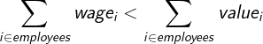

The gender pay gap is a real problem; However, I don't find the phrase "Women get paid less for doing the same job" fitting. My issue is with the word "**same**", I can argue a man and a woman with the same degree and experiences are not expected to do the same job within the current social circumstances. I'm sure anyone reading this is well aware of these circumstances, but they are overlooked in phrases like the one above. Before getting into the main argument of why our social and economical circumstances result in such disparity in pay rates, let's assume that the phrase accurately describes the gender pay gap, meaning that women are getting paid less for doing the **same** job. Now, let's investigate how would it affect other factors in the economy. Throughout this post, we are talking about a capitalist economy and specifically the U.S. economy. In capitalist economies, where the ultimate goal is economic growth and profits, companies' loyalty is to their investors and nothing else. 

>By creating incentives for entrepreneurs to reallocate away resources from unprofitable channels and into areas where consumers value them more highly, capitalism has proven a highly effective vehicle for economic growth.
> -- <cite>[Jim Chappelow][1]</cite>

Now, if women will get less money for doing the same job, isn't it enough incentive for entrepreneurs to reallocate away from hiring men? One might blame social prejudices and biases against women for diffusing the incentives. Don't get me wrong, I don't think there are no such biases against women; however, I believe only a single entrepreneur without such biases and willingness to capitalize on this unfair situation should be enough to tip the scale. After his/her success, everyone will try to reallocate their resources and as a result, the system will balance itself.

Having the definition of Capitalism in mind, for a company to be profitable, the following equation should hold:

 

 
 
Where the summation is on all the companies' employees. This equation simply states the summation of all wages the company pays to its employees should be less than the value they produce for the company, otherwise, the company cannot be profitable. So my understanding is that a company sets the salaries based on the expected value each employee is likely to produce and readjusts this estimation every year or so hence the promotions and raises. If this estimate is too high and results in paying most of the employees more than what they produce, the company will struggle. On the other hand, low estimates will result in low employee morale and low job satisfaction. While I am not sure how big companies set prices for their employment offers, this equation is in control not in a sense of a real algorithm or code but embedded in managers' minds and decision-making process. Now if women are paid less while having the same job and title in a company, I would argue that this equation is responsible for the pay gap. The equation in managers' minds underestimates the expected value of value production by women and this underestimation results in the pay gap. Obviously, this underestimation has nothing to do with them being able to produce value and it is the results of our social structure. In my opinion, The biggest contributor to this underestimation is how biology, society, and labor laws expect women to contribute more to raising and caring for children. We cannot do anything about biology but the other two can be. The good news is that many countries are well aware of these social inequalities. Here is a map of the countries offering paid paternity leave.

<iframe width="690" height="600" src="http://www.worldpolicycenter.org/embedded/policies/is-paid-leave-available-for-fathers-of-infants"  frameborder="0"></iframe>

In my opinion, As long as society expects women to contribute more to raising and caring for children, the gender pay gap is here to stay. Having the option to have the paid paternity leave is great, but most people are afraid of missing out on opportunities and promotions if they use their paternity leave so they end up following the traditional way. I believe (and I might be wrong) that this is the major contributor that fuels the gender pay gap. Changing what society thinks and expects is a very slow process. I am not in an expert in this field to provide any definitive solution but the only fast enough solution to break such expectations might be force parental leave and it is getting implemented in some companies.

>It’s my hope that one day we won’t have to mandate this, but that it’ll be expected of men to share childcare duties with women. This will unlock performance advantages for companies and ensure gender equality at work. Mandating paternity leave is a relatively simple step towards that future. I hope other companies follow suit.
> -- <cite>[Ben Waber, president and CEO of Humanyze][2]</cite>

Let us get back to the phrase "Women get paid less for doing the same job". However, as we discussed, at least in the employer's eye, women are not going to do the same job even though they have the same education, experience, and job description. I blame social norms and labor laws for it. I think the phrase "Women get paid less because they are expected (unjustly) to not do the same job in the long run" better describes the situation but its not as catchy.

[1]: https://www.investopedia.com/terms/c/capitalism.asp
[2]: https://qz.com/work/1284912/paid-parental-leave-why-i-require-new-fathers-who-work-for-me-to-take-it/
